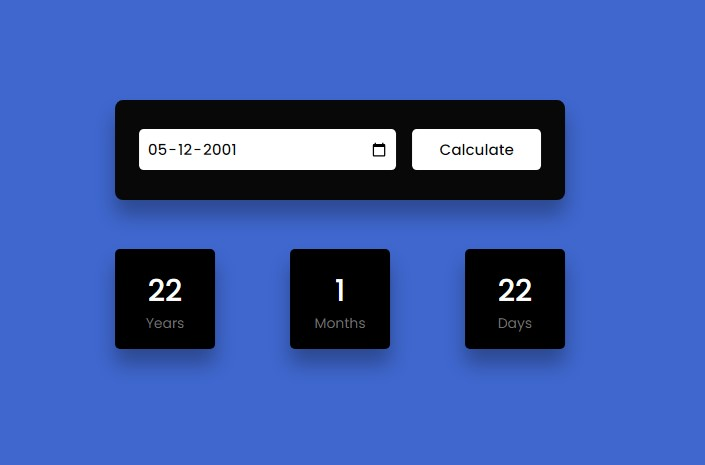

# Age_Calculator
- This project is to calculate the age of the user.
- This project is made with Javascript and decorated with HTML and CSS.
- Here when the user inputs his birthday date in given input , the exact age with months and days will be displayed in screen.
- This is simple age_calculator made with JavaScript, and it is a beginner project.

### Result Image for Age_Calculator
